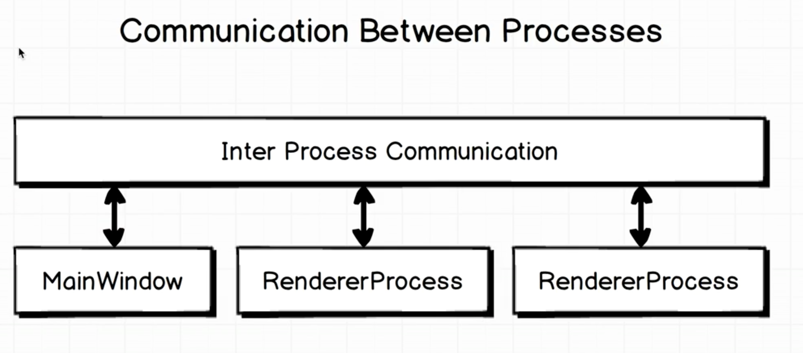
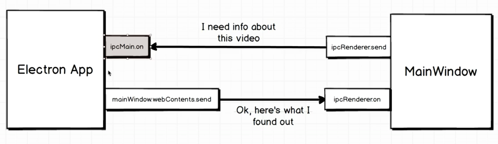

# Video Info 
An Electron app that shows basic information about a video file on your local hard drive.

## FFMPEG
Install FFMEG on Mac using Homebrew:
```bash
brew install ffmpeg
```
Install fluent-ffmpeg from npm:
```bash
npm install --save fluent-ffmpeg
```
## IPC - inter process communication
The communication protocol for sending events between the mainProcess and RenderProcesses.
 


## Basic Communication in this app



### MainWindow
#### Send
```javascript
ipcRenderer.send('nameOfEvent', objectToSend);
```
#### Receive
```javascript
ipcRenderer.on('eventListingFor', (event, data) => {
  
});
```

### Electron App
#### Receive
```javascript
ipcMain.on('eventToListenFor', (event, dataIn) => {
  
});
```
#### Send 
```javascript
mainWindow.webContents.send('eventToSend', dataToSend);
```
